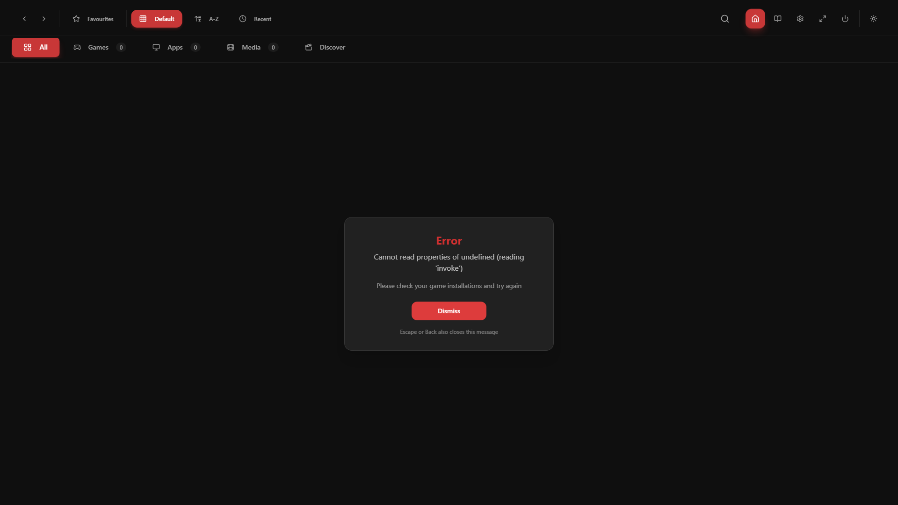
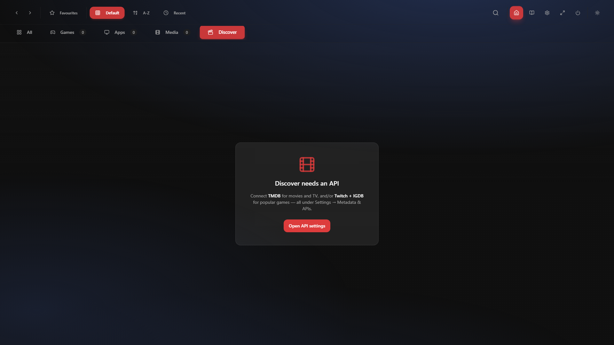
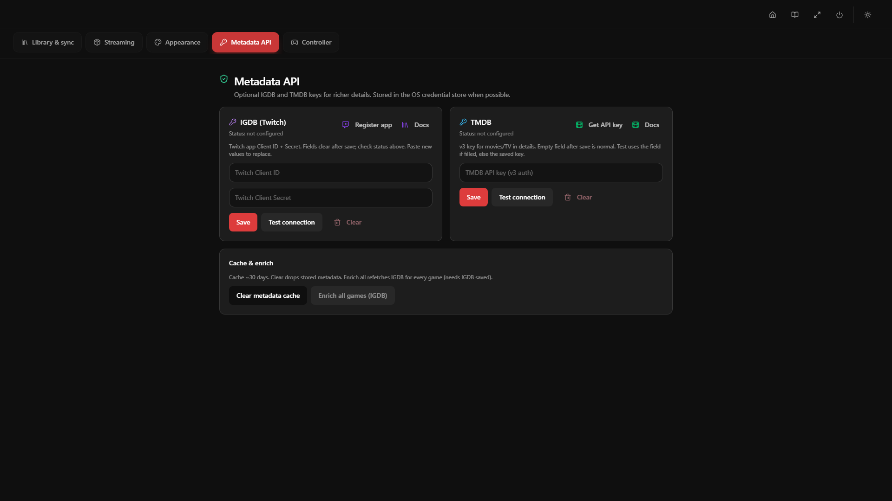
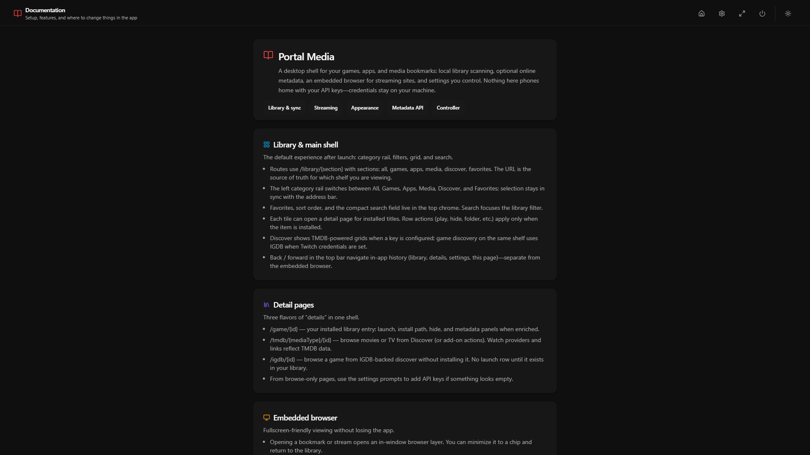

# Portal Media - Game Launcher

[](https://github.com/tanvoid0/portal-media)
[](https://github.com/tanvoid0/portal-media/releases/latest)
[](#license)

A lightweight, fullscreen game and app launcher with a **console-style** (horizontal shelf) UI, optimized for controller navigation and minimal resource usage.

<p align="center">
  
</p>

<p align="center">
  
  &nbsp;
  
</p>

<p align="center">
  
</p>

*Demo stills are auto-generated (Playwright + Vite, dark theme, 1920×1080). Your library and API state will differ. Regenerate with `pnpm screenshots` after `pnpm screenshots:install`.*

## Features

- **Fullscreen Mode**: Borderless, always-on-top option for immersive experience
- **Controller Navigation**: Common gamepad layouts (asymmetric face buttons, shape-labeled face buttons, and generic fallbacks)
- **Auto-Detection**: Automatically scans Steam, Epic Games, GOG, and Windows apps
- **Manual Addition**: Add custom games, apps, and bookmarks
- **Big-tile UI**: Horizontal scrolling, large cards, smooth animations
- **Low Resource Usage**: Built with Tauri for native performance
- **Fast Launch**: Direct executable launching, no launcher overhead
- **Search**: Quick search functionality to find games
- **Bookmarks**: Add web links as launchable items

## Add-ons and plugins

Streaming catalog add-ons are optional zip archives with a `manifest.json`; the app loads them from your profile `plugins` folder or configured paths. See **[docs/PLUGINS.md](docs/PLUGINS.md)** for the manifest schema, packaging, discovery order, and a roadmap for future game/app plugin surfaces.

## Technology Stack

- **Framework**: Tauri 2.0 (Rust backend + Web frontend)
- **Frontend**: React + TypeScript + Vite
- **UI Library**: TailwindCSS + shadcn/ui
- **State Management**: Zustand
- **Package Manager**: pnpm

## Development

### Prerequisites

- Node.js 18+ and pnpm
- Rust (for Tauri backend)
- Windows SDK (for Windows builds)

### Setup

1. Install dependencies:
```bash
pnpm install
```

2. Run in development mode:
```bash
pnpm tauri dev
```

3. Build for production:
```bash
pnpm tauri build
```

### Demo screenshots (automation)

Regenerate the images under `public/screenshots/` (used by this README and the in-app **Documentation** page):

```bash
pnpm screenshots:install   # once per machine: download Chromium for Playwright
pnpm screenshots          # starts Vite on port 1420, captures each route, writes PNGs
```

Requires port **1420** free (stop `pnpm dev` / `tauri dev` first). The script drives the **web** build of the UI; it matches the Tauri WebView closely and runs without the Rust backend (empty library / API errors are normal).

## Controls

### Keyboard
- **Arrow Left/Right**: Navigate between games
- **Enter/Space**: Launch selected game
- **Escape**: Back/Exit

### Gamepad
- **D-pad Left/Right or Left Stick**: Navigate between games
- **South face button** (e.g. bottom): Launch selected game
- **East face button** (e.g. right): Back
- **Menu**: Open settings

## Game Detection

The app automatically scans for:
- **Steam**: Reads from Steam library folders
- **Epic Games**: Scans Epic Games Launcher installations
- **GOG**: Scans GOG Galaxy games
- **Windows Apps**: Scans Start Menu and common install directories

## Adding Games Manually

1. Go to Settings
2. Use the "Add Bookmark" feature for web links
3. For local games, the app will detect them automatically during scanning

## License

MIT
